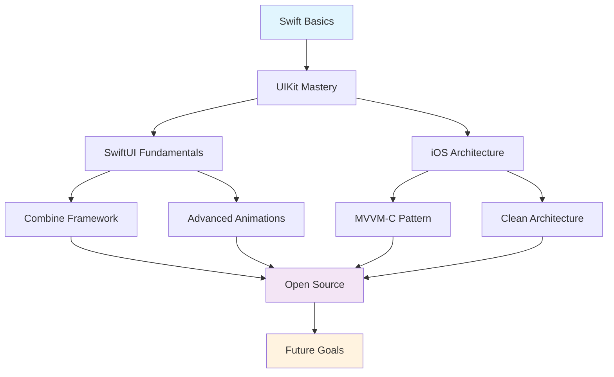

<div align="center">

# 👋 Hey there, I'm zylcold

iOS Developer · Swift / SwiftUI · AI-assisted development

<a href="https://github.com/zylcold"></a>

</div>

---

## 🚀 About Me


```swift
class Developer {
    let name = "zylcold"
    let role = "iOS Developer"
    let language_spoken = ["zh_CN", "en_US"]
    
    func getCurrentFocus() -> [String] {
        return [
            "SwiftUI & Combine",
            "iOS Architecture",
            "Open Source"
        ]
    }
    
    func getFutureGoals() -> [String] {
        return [
            "Master ARKit",
            "Contribute to Swift",
            "Build Amazing Apps"
        ]
    }
}
```
<br clear="both"/>

## 🧑‍💻 Tech Stack & Tools

<div align="center">

### 💻 Languages


### 📱 Frameworks & Libraries


### 🛠️ Development Tools


### 📊 Databases & Backend


</div>

## 📊 GitHub Analytics

<div align="center">
  
  
</div>

## 🛠 Featured Projects

<div align="center">

<a href="https://github.com/zylcold/LoveLinkProject">
  
</a>
<a href="https://github.com/zylcold/JYFoundation">
  
</a>
<a href="https://github.com/zylcold/JYPhotoBrowser">
  
</a>

</div>

### 📱 iOS Apps
- **[LoveLinkProject](https://github.com/zylcold/LoveLinkProject)** `Swift` `SwiftUI` `Modular Architecture`
  > A modularized iOS project with multiple components for social networking and dating apps.
  
- **[JYFoundation](https://github.com/zylcold/JYFoundation)** `Swift` `iOS Framework` `Utilities`
  > A lightweight framework for common utilities and extensions in iOS development.
  
- **[JYPhotoBrowser](https://github.com/zylcold/JYPhotoBrowser)** `Swift` `UIKit` `Animations`
  > A customizable photo browser for iOS with smooth animations and gestures.

## 📚 Learning & Growth Journey

<div align="center">



</div>

### 🎯 Current Focus
```swift
let currentLearning = [
    "Advanced Swift Concurrency (async/await)",
    "SwiftUI Advanced Animations", 
    "Clean Architecture Patterns",
    "iOS Performance Optimization",
    "Vibe Coding Workflow (AI-assisted coding + fast prototyping)"
]
```

### 🚀 2026 Goals
- [ ] Ship AI-assisted iOS developer workflow templates
- [ ] Integrate Vibe Coding in daily feature prototyping
- [ ] Build and launch 2 iOS apps
- [ ] Write and publish technical blog posts about AI + iOS
- [ ] Speak at iOS/AI community events

## 🤖 Agent Engineering Notes (2026)

### 🧠 Agent Knowledge Map
- **Planning**: Break tasks into verifiable checkpoints before coding
- **Tool Use**: Prefer deterministic tools (search, tests, CI logs) over guesswork
- **Memory**: Persist stable conventions and avoid session-only assumptions
- **Validation**: Run review/security checks before final output
- **Feedback Loop**: Use comment-driven iteration to refine small PRs quickly

### 🧰 Agent Workflow I Use
```text
Intent -> Plan -> Search -> Edit -> Validate -> Review -> Ship
```

### ⭐ Agent Projects (Recent Star References)
- [microsoft/autogen](https://github.com/microsoft/autogen) - Multi-agent orchestration patterns
- [crewAIInc/crewAI](https://github.com/crewAIInc/crewAI) - Role-based collaborative agents
- [langchain-ai/langgraph](https://github.com/langchain-ai/langgraph) - Stateful agent graphs
- [OpenInterpreter/open-interpreter](https://github.com/OpenInterpreter/open-interpreter) - Local tool-using code agent
- [All-Hands-AI/OpenHands](https://github.com/All-Hands-AI/OpenHands) - Software engineering agent runtime

## 🛡 Developer Philosophy

<div align="center">

| Principle | Description |
|-----------|-------------|
| 🧹 **Clean Code** | *"Code is read more often than it is written"* |
| 🚀 **Performance** | *"Premature optimization is the root of all evil"* |
| 🤝 **Collaboration** | *"Alone we can do so little; together we can do so much"* |
| 📚 **Learning** | *"Stay hungry, stay foolish"* |

</div>

## 📫 Let's Connect & Collaborate

<div align="center">

<p>
<a href="https://github.com/zylcold">
  
</a>
</p>

For project discussions, please open an issue in the relevant repository.

</div>

## 🖖 Fun Facts & Terminal

<div align="center">

```bash
$ whoami
zylcold

$ cat interests.txt
🔍 Reverse engineering iOS apps
🤖 Automation enthusiast - "If it can be automated, it will be"
🕶️ AR/VR exploration
🔧 Raspberry Pi tinkering
☕ Coffee-driven development

$ uptime
iOS development since 2018 📱

$ ps aux | grep passion
swift      1337  0.1  0.2  building_amazing_apps
automation 2022  0.0  0.1  scripting_everything  
learning   2024  1.0  0.5  exploring_new_tech
vibe      2026  1.0  0.6  ai_pair_programming
```

</div>

---

> "Code is like humor. When you have to explain it, it’s bad." – Cory House

<div align="center">


**Thanks for visiting! 🚀**

*Made with ❤️ and lots of ☕*

</div>
