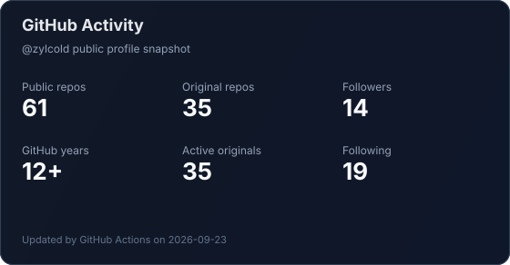
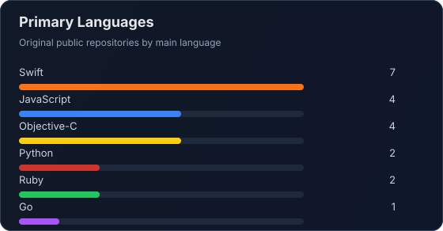

# 👋 我是云龙

**iOS 独立开发者 · AI Agent 方向 · 全栈玩家** · 🇨🇳 China

## 🧑‍💻 关于我

白天写 SwiftUI，晚上折腾 AI Agent 基建——正在用 agent 开发 agent。

- 🍎 三款 App 上架 App Store：**格物**（物品收纳 · 端侧 AI 识别）、**照片回顾**（旅行照片地图）、**双键**（密码管理）
- 🤖 Agent 工程：OpenClaw 全家桶、DriftBuild 远程构建、owl-skills、自建 9router 模型路由
- ⚡ 全栈：Cloudflare Workers · TypeScript · Python
- 🔧 XcodeGen / Fastlane / Xcode Cloud / App Store Connect 自动化

## 🐍 贡献贪吃蛇

<picture>
  <source media="(prefers-color-scheme: dark)" srcset="https://raw.githubusercontent.com/zylcold/zylcold/output/github-contribution-grid-snake-dark.svg" />
  <source media="(prefers-color-scheme: light)" srcset="https://raw.githubusercontent.com/zylcold/zylcold/output/github-contribution-grid-snake.svg" />
  
</picture>

## 🛠️ 技术栈

## 📊 GitHub 数据

*自托管统计（GitHub Actions 每日生成），私有仓库贡献不完全计入。*

## 🚀 产品与开源

### 🍎 App Store

| App | 一句话 | 项目主页 |
|-----|--------|----------|
| **格物** | 本地优先的物品收纳管理，端侧 AI 识别，iCloud 家庭共享 | [gewu-site](https://github.com/zylcold/gewu-site) |
| **照片回顾** | 旅行照片地图，轨迹与回忆 | [travelsmap-site](https://github.com/zylcold/travelsmap-site) |
| **双键** | 双拼输入法练习与离线系统键盘（小鹤/微软/搜狗） | [dualkey-site](https://github.com/zylcold/dualkey-site) |

### 📦 GitHub

| 项目 | 说明 |
|------|------|
| [XcodeBar](https://github.com/zylcold/XcodeBar) | macOS 菜单栏 Xcode 构建监控 |
| [BlindWatermark](https://github.com/zylcold/BlindWatermark) | iOS 屏幕级盲水印 |
| [openclaw-observatory](https://github.com/zylcold/openclaw-observatory) | OpenClaw 本地可观测性平台 |
| [DriftBuild](https://github.com/zylcold/DriftBuild) | Swift 远程构建工具链 |
| [dungeon-mizong-game](https://github.com/zylcold/dungeon-mizong-game) | 迷踪 · Roguelike 网页游戏 |
| [daily_stock_analysis](https://github.com/zylcold/daily_stock_analysis) | LLM 驱动的市场分析流水线 |

*⚡ Powered by SwiftUI & AI Agents*

